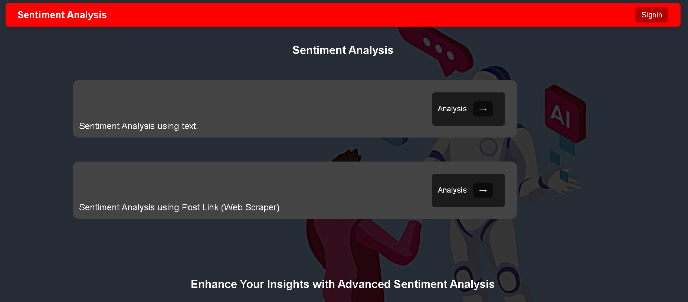
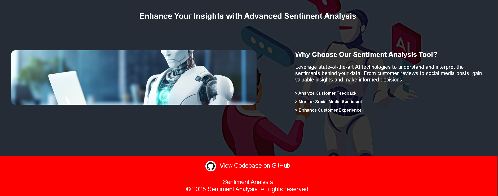
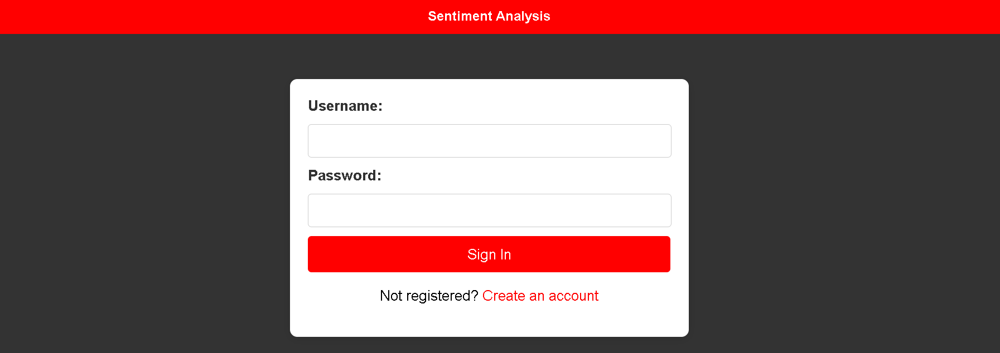
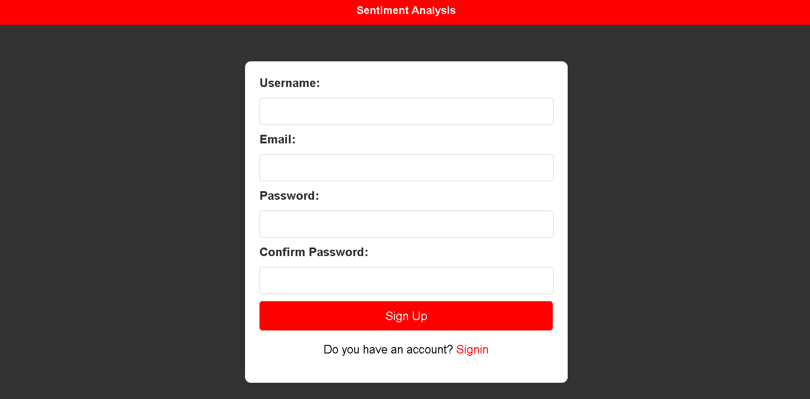

# Sentiment Analysis

# Live Link : https://kyn.zeal.ninja/

**Demo Video Link:** https://youtu.be/0UiwfRd5fiE


> ## Step-by-Step Guide to Setting Up and Running the Application

1. **Clone the Repository**
   ```bash
   git clone https://github.com/williyam-m/sentiment_analysis.git
   ```

2. **Navigate into the Repository Directory**
    ```bash
   cd sentiment_analysis
   ```

3. **Create a Virtual Environment**
    ```bash
   python -m venv venv
   ```
4. **Activate the Virtual Environment**

   - **On Windows:**
     ```bash
     venv\Scripts\activate
     ```
   - **On Linux/macOS:**
     ```bash
     source venv/bin/activate
     ```
5. **Install Required Packages**
    ```bash
   pip install -r requirements.txt
    ```
6. **Run the Application**
 
   ```bash
   python manage.py runserver
   ```

7. **Open your web browser and go to**
   ```bash
   http://localhost:8000
   ```
   


### Sentiment Analysis using Text
 - Harness the potential of advanced AI to delve deep into your text and uncover the true sentiment behind every word!


### Sentiment Analysis using Post Link (Web Scraper)
 - Effortlessly analyze sentiment from post links with our powerful web scraper, transforming raw data into actionable insights!


### Tech Stack

 - Django: Web framework for building the application.
 - Torch: PyTorch, for deep learning models.
 - Transformers: Hugging Face library for pre-trained models.
 - Numpy: Numerical operations.
 - Pandas: Data manipulation and analysis.
 - BeautifulSoup4: Web scraping.
 - Requests: For making HTTP requests, useful in web scraping.
 - Pytest: Testing framework.
 - HTML/CSS: Front-end design.


<p align="center">
  
  
</p>

<p align="center">
  
  
</p>


## References and Resources

 - Django Documentation: https://docs.djangoproject.com/
 - Python Official Documentation: https://docs.python.org/3/
 - Pytorch: https://pytorch.org/
 - Transformers: https://huggingface.co/
 - Numpy: https://numpy.org/
 - Pandas: https://pandas.pydata.org/
 - BeautifulSoup4: https://pypi.org/project/beautifulsoup4/
 - SQLite: https://www.sqlite.org/index.html
